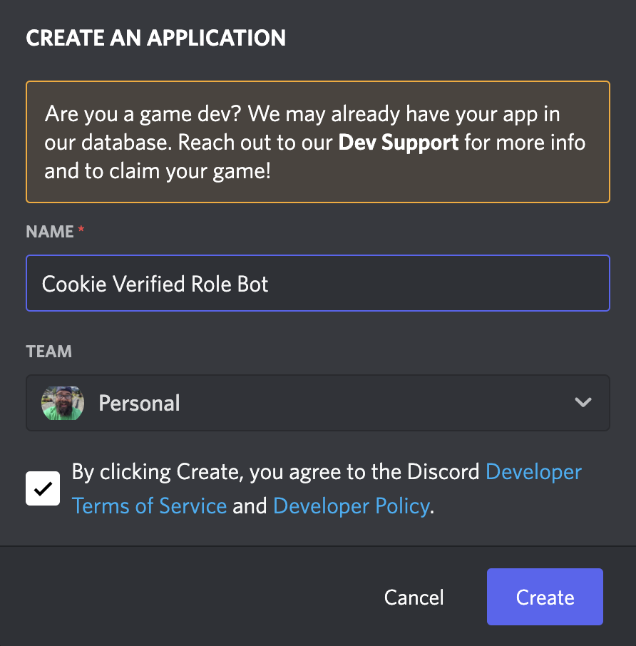
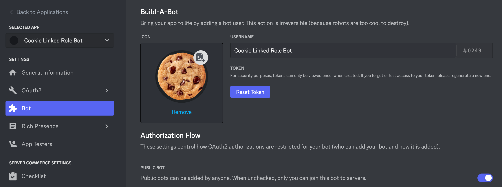
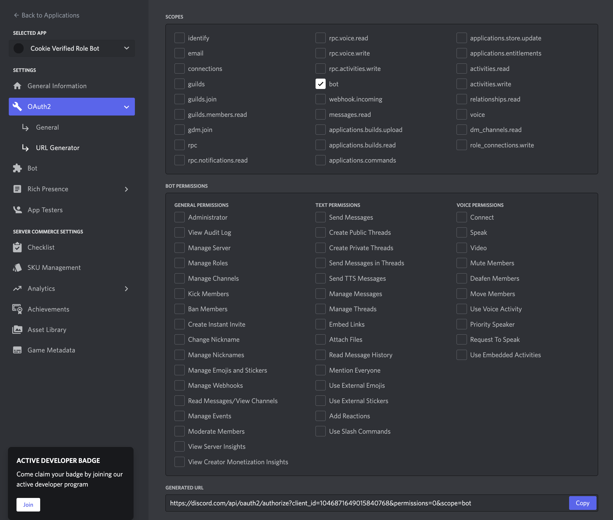
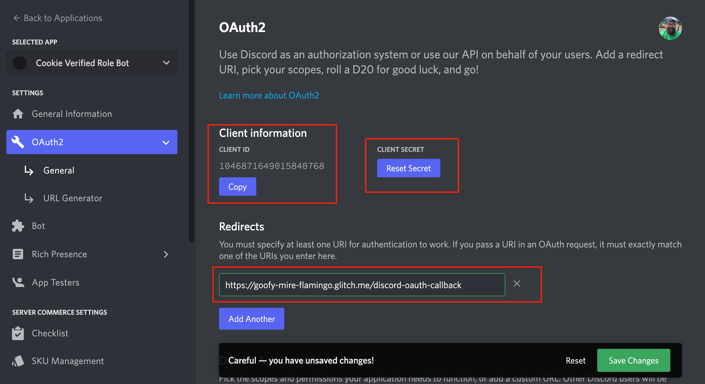
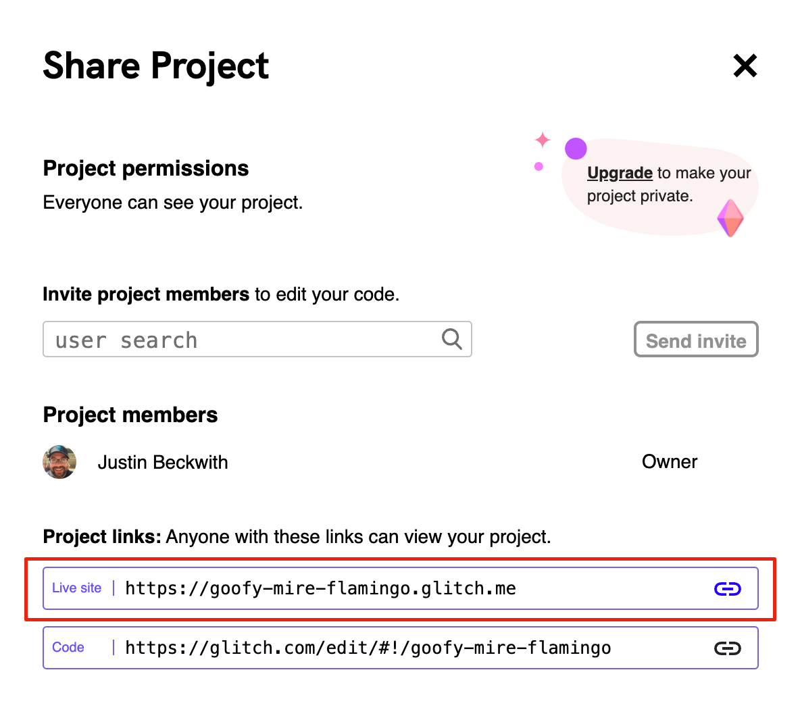
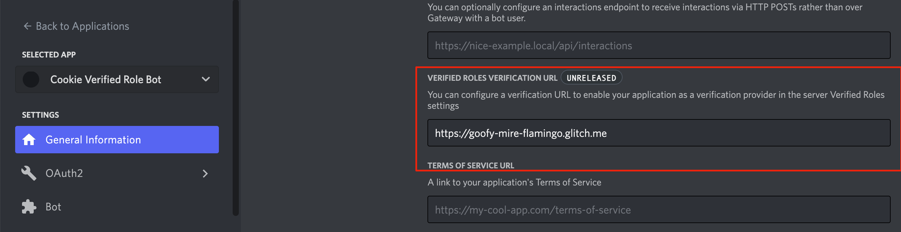
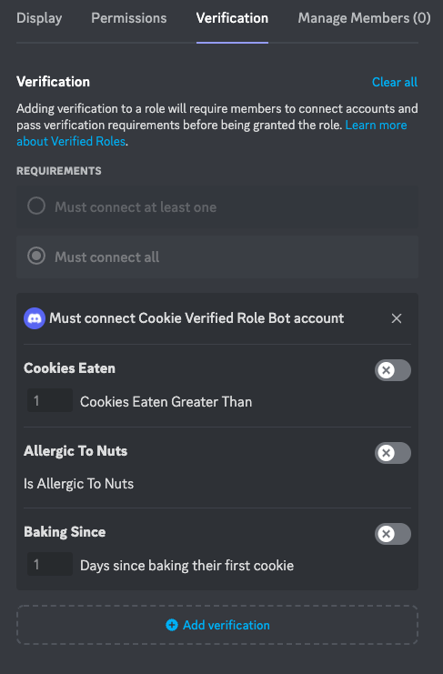
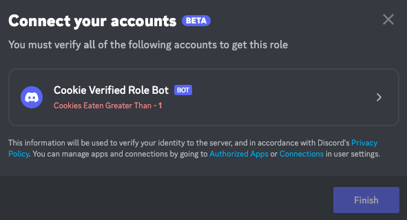
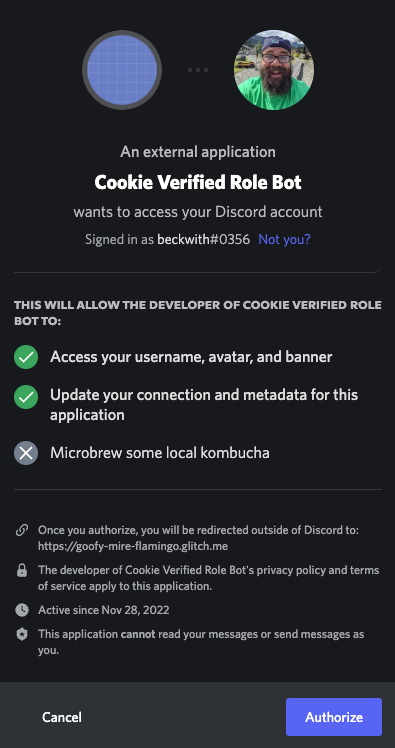
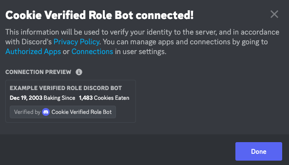

# Discord Linked Role Bot Example
This repository contains the documentation and example for a linked role bot.

## Creating an App
The first thing we’ll need to do is create an app. Navigate to the [developer dashboard](https://discord.com/developers/applications), then click New Application in the upper right corner.



Enter a name for your app, then click Create.

Once you create an app, you'll land on the General Overview page of the app's settings. Here you can view and configure basic information about the app, like its description and icon. You’ll also see an Application ID and Linked Roles Verification URL, which we’ll use a bit later in the guide.

### Configuring a bot
Next we'll add a bot user to your app, which allows it to appear in Discord similar to other members. On the left hand sidebar click Bot, then the Add Bot button.

Once you create a bot, you’ll have an option to update its icon and username. Under that, there’s a Token section with a Reset Token button.



Bot tokens are used to authorize API requests and carry all of your bot user’s permissions, making them highly sensitive. Make sure to never share your token or check it into any kind of version control.

Go ahead and click Reset Token, and store the token somewhere safe (like in a password manager).

### Adding scopes and permissions
Apps need approval from installing users to perform actions inside of Discord (like creating a slash command or adding emojis). So before installing your app, let's add some scopes and permissions to request during installation. Click on OAuth2 in the left sidebar, then URL generator.

For now, we only need the `bot` scope. 



See a list of all [OAuth2 scopes](https://discord.com/developers/docs/topics/oauth2#shared-resources-oauth2-scopes), or read more on [user permissions](https://discord.com/developers/docs/topics/permissions) in the documentation.

Once you add scopes, you should see a URL that you can copy to install your app.

### Installing your app
Copy the URL from above, and paste it into your browser. You’ll be guided through the installation flow, where you should make sure you’re installing the app on a server where you can develop and test.

After installing your app, you can head over to your server and see that it has joined ✨

With your app configured and installed, let’s start developing it.

## Running your app
All of the code used in the example app can be found in the [Github repository](https://github.com/JustinBeckwith/linked-role-bot).


### Remix the project
This guide uses Glitch, which allows you to quickly clone and develop an app from within your browser. There are also instructions on developing locally using ngrok in the README if you'd prefer.

> While Glitch is great for development and testing, [it has technical limitations](https://help.glitch.com/kb/article/17-technical-restrictions/) so other hosting providers should be considered for production apps.

To start, [remix (or clone) the Glitch project 🎏](https://glitch.com/edit/#!/remix/linked-role-discord-bot)

When you remix the project, you'll see a new Glitch project with a unique name similar to this:


#### Project structure
All of the files for the project are on the left-hand side. Here's a quick glimpse at the structure:

```
├── assets      -> images used in this tutorial
├── src
│   ├── config.js   -> Parsing of local configuration
│   ├── discord.js  -> Discord specific auth & API wrapper
│   ├── register.js -> Tool to register the metadata schema
│   ├── server.js   -> Main entry point for the application
│   ├── storage.js  -> Provider for storing OAuth2 tokens
├── .env -> your credentials and IDs
├── .gitignore
├── package.json
└── README.md
```

### Credentials & Configuration
There's already some code in your `server.js` file, but you’ll need your app’s token and ID to make requests. All of your credentials can be stored directly in the `.env` file.

> It bears repeating that you should never check any credentials or secrets into source control. The getting started project's `.gitignore` comes pre-loaded with `.env` to prevent it.

First, copy your bot user’s token from earlier and paste it in the `DISCORD_TOKEN` variable in your `.env` file.

Next, navigate to your app settings in the developer portal, and navigate to OAuth2 -> General.  Copy the Client ID and Client Secret for your application, and paste the values as `DISCORD_CLIENT_ID` and `DISCORD_CLIENT_SECRET` in your `.env`.  



Now, we need to set the Redirect Url that will be used for our OAuth2 flow.  Go back to glitch, and click the `Share` button for your project.  Copy the public live URL for your app:



Go back to the OAuth2 -> General tab in the Discord developer portal, and add a new redirect for your app using the Glitch url and the `/discord-oauth-callback` route.  Copy this full url, and paste it as `DISCORD_REDIRECT_URI` into your `.env` as well.  

Go to the General Information tab in the developer portal, and scroll down to the `Linked Roles Verification Url` field. Paste the base url to your glitch service, add the `/linked-role` route, and save:



Finally, to generate a unique cookie secret, go back to glitch, and click on the `Terminal` tab. Run the following commands:

```
$ node
crypto.randomUUID()
```

Copy the randomly generated UUID, and paste it into your `.env` as `COOKIE_SECRET`. Your `.env` should look something like this:

```
DISCORD_CLIENT_ID: <your OAuth2 client Id>
DISCORD_CLIENT_SECRET: <your OAuth2 client secret>
DISCORD_TOKEN: <your bot token>
DISCORD_REDIRECT_URI: https://<your-project-name>.glitch.me/discord-oauth-callback
COOKIE_SECRET: <random generated UUID>
```

### Registering your metadata schema
As a one time step, you must tell Discord which metadata fields you are going to use for your linked role. The code for configuring this metadata is in [src/register.js](), and it is meant to be run as a command line application.  Go back to glitch, click the terminal tab, and run the following command:

```
$ node src/register.js
```


## Try it out
Now that you've built your bot, let's give it a try both from the server owner and the user's perspective.

### Creating the linked role
To try out our bot, we're going to create a linked role in a server where you have admin permissions.  Open up the server settings, select roles, and click on `Create Role`.  Give the role a name, save it, then click on `Links`.  Click the `Add requirement` button, and you should see your bot in the list of available Apps.  Click on it, and you will see a setup screen where you can configure specific criteria for your role.



### Acquiring the role
To acquire your newly created role, click the server name in the upper left corner of the screen, and select `Linked Roles`.  Click on your role, and it will present the opportunity to connect your account.



Click on the linked role criteria. This should lead to the Discord OAuth2 consent screen.  Click `Authorize`, and then return to Discord.  



After returning to Discord, you should see a confirmed linked role.



Finally, create a new private channel, and add the new linked role.

## Tips & Tricks

### Token storage
This bot largely relies on Discord's [OAuth2](https://discord.com/developers/docs/topics/oauth2) implementation to obtain access tokens. This model of user based authentication relies on storing refresh tokens, and using them to acquire access tokens.  The example code in [src/storage.js](src/storage.js) uses in-memory storage to manage these tokens, but for any production deployment a database with persistent storage should be used. 

### Advanced examples
For a more complex example, see https://github.com/JustinBeckwith/fitbit-discord-bot/.
